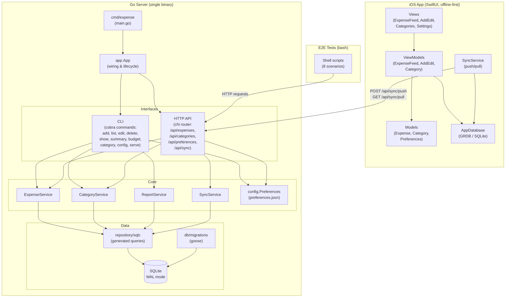

# Architecture Walkthrough — Expense Tracking

A personal, single-user expense tracker with three interfaces: a **Go server** (source of truth), a **CLI**, and an **offline-first iOS app** (SwiftUI). SQLite is used on both sides.

---

## System Diagram

---

## Layer-by-Layer Breakdown

### 1. Entrypoint — `server/cmd/expense/main.go`

Single `main()` that creates an `app.App` and hands it to the CLI root command. Everything flows from here.

### 2. App Wiring — `server/internal/app/app.go`

`app.Open(dbPath, configPath)` bootstraps the entire application:
- Loads `preferences.json` via `config.LoadPreferences()`
- Opens SQLite with WAL mode and foreign keys enabled
- Runs Goose migrations from embedded SQL files (`db/migrations/`)
- Creates sqlc `Queries` instance
- Constructs all four services: `ExpenseService`, `CategoryService`, `ReportService`, `SyncService`
- Seeds default categories on first run

### 3. Interfaces (CLI + HTTP API)

Both interfaces share the same service layer — they are thin wrappers:

| Interface | Tech | Files |
|-----------|------|-------|
| **CLI** | Cobra | `server/internal/cli/` — 12 command files (`add`, `list`, `edit`, `delete`, `show`, `summary`, `budget`, `category`, `config`, `serve`, `format`, `root`) |
| **HTTP API** | chi (stdlib `net/http` compatible) | `server/internal/api/` — `router.go` + per-resource handlers (`expenses.go`, `categories.go`, `sync.go`, `preferences.go`, `health.go`) |

**API routes:**
- `POST/GET/GET/:id/PUT/:id/DELETE/:id` — `/api/expenses`
- `POST/GET/PUT/:id/DELETE/:id` — `/api/categories`
- `GET/PUT` — `/api/preferences`
- `POST /api/sync/push`, `GET /api/sync/pull?since=` — sync endpoints (`since` is the last pulled `server_version`)

### 4. Service Layer — `server/internal/service/`

Business logic, shared by CLI and API:

| Service | Responsibility |
|---------|---------------|
| `ExpenseService` | CRUD for expenses, amount-in-cents handling |
| `CategoryService` | CRUD for categories, default seeding, budgets |
| `ReportService` | Aggregations and summaries (used by `expense summary`) |
| `SyncService` | Push/pull logic — version-cursor pull, read-only snapshots, conflict resolution, server-as-truth |

### 5. Data Layer — `server/internal/repository/sqlc/`

- **sqlc-generated** Go code from SQL queries in `db/queries/` (`expenses.sql`, `categories.sql`)
- Generated models in `models.go`, query methods in `expenses.sql.go` / `categories.sql.go`
- Database connection managed by `db.go`

### 6. Database — SQLite

- Single-file DB with WAL journaling and foreign keys
- Schema managed by Goose migrations (`db/migrations/00001_init.sql`)
- Soft deletes everywhere (`deleted_at` column) — critical for sync

### 7. Configuration — `server/internal/config/preferences.go`

User preferences stored in `preferences.json`:
- `currency` (default: `SGD`)
- `timezone` (default: `Asia/Singapore`)
- `date_format` (default: `2006-01-02`)

Preferences are reloadable at runtime via `app.ReloadPreferences()`.

---

## iOS App — `ios/ExpenseTracker/`

MVVM architecture built with SwiftUI (iOS 17+):

| Layer | Contents |
|-------|----------|
| **Views** | `ExpenseFeed/`, `AddEditExpense/`, `Categories/`, `Settings/` |
| **ViewModels** | `ExpenseFeedViewModel`, `AddEditExpenseViewModel`, `CategoryViewModel` |
| **Models** | `Expense`, `Category`, `Preferences` (GRDB records) |
| **Database** | `AppDatabase` (GRDB wrapper), `DefaultCategories` seed data |
| **Services** | `SyncService` — push-then-pull sync to Go server |

### Sync Flow

1. **Push**: iOS always POSTs to `/api/sync/push`, even when there are no pending local rows. An empty push is the server-side "materialize anything due" ping for recurring expenses. The server responds with canonical rows and the latest `server_version`. iOS updates pushed local records to `synced`.
2. **Pull**: iOS GETs `/api/sync/pull?since=<lastPulledVersion>`. The server runs Pull inside a read-only SQLite transaction, samples `server_version` inside that snapshot, returns all rows with `server_version > since`, and includes dependency categories needed to satisfy client foreign keys. iOS upserts them locally, then stores `response.serverVersion` as the next `lastPulledVersion`.

---

## E2E Tests — `tests/e2e/`

9 bash scripts that spin up the server and exercise it via HTTP:

| Script | Scenario |
|--------|----------|
| `01_daily_expense_workflow.sh` | Basic add/list flow |
| `02_edit_delete_lifecycle.sh` | Edit and soft-delete |
| `03_sync_roundtrip.sh` | Push + pull roundtrip |
| `04_preferences.sh` | Config get/set |
| `05_category_lifecycle.sh` | Category CRUD |
| `06_sync_push_delete.sh` | Push with deletes |
| `07_sync_new_category_reference.sh` | Sync with new category FK |
| `08_sync_equal_timestamp_update.sh` | Equal-`updated_at` tie-breaking |
| `09_sync_reconcile_default_categories.sh` | Default-category ID reconciliation |

---

## Key Design Decisions

- **SQLite everywhere** — same schema on server and iOS, simplifies sync
- **Server is source of truth** — clients always push, then pull by `server_version`; conflicts still use last-edit-wins on `updated_at`
- **Amounts in cents** — all monetary values as `int64` (e.g., $12.50 → 1250)
- **Soft deletes** — `deleted_at` set but never physically removed; critical for sync
- **Unix timestamps** — all times as `int64`, displayed in user's configured timezone
- **Single-user, no auth** — personal tool on a trusted network
- **CLI-first** — every operation the iOS app can do is doable via CLI
