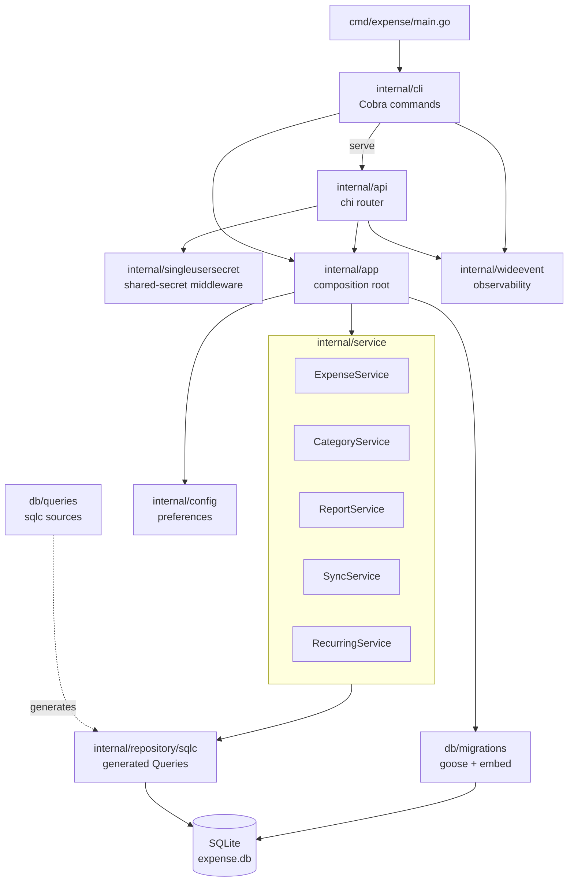

# Server Architecture

The server is a Go application providing both a CLI and an HTTP API for expense tracking. It uses SQLite for storage, sqlc-generated queries, and goose for migrations.

## Layers

- **cmd/expense** — entrypoint; delegates to `cli.Execute`.
- **internal/cli** — Cobra commands (`add`, `list`, `summary`, `serve`, etc.).
- **internal/api** — chi-based HTTP router exposing `/api/expenses`, `/api/categories`, `/api/preferences`, `/api/sync/*`, `/api/health`.
- **internal/singleusersecret** — shared bearer-token middleware guarding `/api/*` (except health). Package name encodes the assumption that the system has exactly one principal; see `docs/adr/005-single-user-auth-scope.md`.
- **internal/app** — composition root: opens SQLite, runs goose migrations, wires services.
- **internal/service** — business logic: `Expense`, `Category`, `Report`, `Sync`, `Recurring`.
- **internal/repository/sqlc** — sqlc-generated typed query layer.
- **internal/config** — preferences (timezone, currency, etc.) loaded from JSON.
- **internal/wideevent** — structured observability events.
- **db/migrations** — goose SQL migrations (embedded via `embed.go`).
- **db/queries** — sqlc query sources.

## Diagram

## Request flow (HTTP)

1. `cli serve` builds an `app.App` and calls `api.NewRouter`.
2. Each request passes through `observabilityMiddleware`, then `singleusersecret.Require` (except `/api/health`).
3. Handlers call into the appropriate service on `app.App`.
4. Services use the sqlc `Queries` to read/write SQLite.
